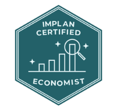

# Professional and Community Programs

{: width="160"}

## Context

Product adoption extends beyond individual customer accounts. Professionals who build recognized expertise, and students who learn a tool early in their careers, become long-term users and advocates. IMPLAN supports this through two programs led by my department: **IMPLAN in the Classroom** and **IMPLAN Certified Economist**.

---

## My role and scope

My department, Education Services, leads both programs. As Director of Education Services, I lead and oversee them as part of the department's portfolio, including program direction, coordination, and their connection to broader customer and Education Services strategy.

---

## The programs

### IMPLAN in the Classroom

Brings IMPLAN into academic settings so students and instructors can work with economic impact analysis as part of their coursework.

- Builds academic engagement and familiarity with the product
- Develops future practitioners who understand both the tool and its appropriate use
- Extends IMPLAN's reach into the communities where economic analysis is taught

### IMPLAN Certified Economist

A professional credential for IMPLAN users that recognizes expertise in applying the product and interpreting economic impact analysis.

- Supports professional development for practitioners
- Reinforces deep product knowledge and responsible model use
- Gives customers and their organizations a recognized marker of expertise

---

## Why these programs matter

Both programs support adoption from a different angle than direct customer support:

- **Community engagement:** they connect IMPLAN with practitioners, instructors, and students beyond day-to-day support interactions.
- **Professional development:** they give users a path to build and demonstrate expertise.
- **Product knowledge:** they deepen understanding of how the product works and when it is appropriate to use.
- **Broader adoption:** they introduce the product to new users and strengthen commitment among existing ones.

They also reinforce the responsible-use themes in [Responsible Education for Economic Impact Analysis](implan-responsible-education.md).

---

## Related Projects

- [Responsible Education for Economic Impact Analysis](implan-responsible-education.md)
- [Premium Support and Strategic Customer Onboarding](customer-adoption-programs.md)
- [Customer Insight, Onboarding Needs, and Content Strategy](education-strategy-learning-paths.md)

---

## Capabilities Demonstrated

- Program leadership and oversight
- Professional credentialing programs
- Academic and community engagement
- Customer and user adoption strategy
- Applied economics expertise
